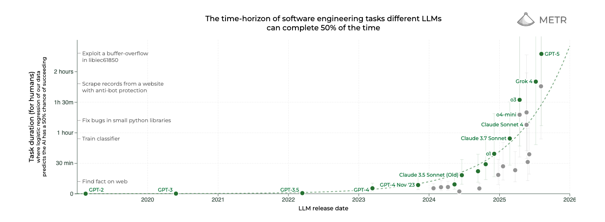

# Why the AI winners won't just be the best models?

AI startups keep popping up like mushrooms after rain, and I'm especially calling out the ones with **.ai** domains. Think of a word, and there is probably already a company **\<word>.ai** that exists 🤯.

[Crunchbase](https://news.crunchbase.com/venture/startups-ai-seed-investors-data-charts-ye-2024/) data shows AI-related funding jumped sharply in 2024 (an ~80% increase year-over-year), and [PitchBook](https://pitchbook.com/news/articles/nearly-1-in-4-new-startups-is-an-ai-company) reports that nearly 1 in 4 new startups that raised money this year is an AI company. So what is each company doing, and how do they plan to differentiate when most of them rely on the same underlying models?  Some of these companies differentiate by clever system prompts, fine-tuned open-source LLMs, or just demo videos (some of these demo videos only work on the presenter's system, and never see the light of the day). Here's the awkward question most founders and investors are puzzling to get answers to: *If models keep getting better every week, what actually stops an OpenAI or Anthropic clone from shipping your product tomorrow?*

## The Augmentation Gap

The invisible distance between "the response users can get on ChatGPT" and "what your customer experiences on your product" - I'm calling this distance **"The Augmentation Gap Index"**. Funnily enough, it forms the acronym AGI. Note that "ChatGPT" here refers to any LLM apps (Gemini, Claude, DeepSeek) that people might already be using to complete their tasks and goals. And your app either makes it easy to do - what was already possible with ChatGPT but difficult, or creates a new workflow that is not currently possible with ChatGPT. For example, if your product is replying to emails - people might likely already be doing this with ChatGPT, but maybe your product just makes the experience much better. So instead of copy pasting mails, you could have a browser plugin or a native mail app itself that replies to emails using AI.

Below are 2 popular companies known to have a high Augmentation Gap Index:
1. **Perplexity** is on track to be doing an annualized revenue of [148M USD this year](https://sacra.com/c/perplexity/). This is a good example for this index, as they seem to have survived the "what if ChatGPT has search tomorrow?" backlash. When they launched their search product, it was not a native LLM functionality, so they had a good AG (Augmentation Gap) index. But I think over time that gap might be narrowing. And that could be one of the reasons, they made a pivot to more agentic products like Comet browser. I think they, out of all the ai companies, understand the importance of this index.
2. **Cursor IDE** is another product that I use almost daily. This product might be the epitome for this index. [500M dollars of ARR](https://finance.yahoo.com/news/cursors-anysphere-nabs-9-9b-221451571.html) — and a valuation of 10 billion USD. This is a prime example of how you take an existing workflow, and add AI on top. People coded all the time, but this company set the precedent for using AI to enhance that experience. With both OpenAI and Claude releasing their own coding tools, I think the AG index for Cursor is not decreasing any time soon.

These examples show that the product experience has limited correlation with the model's quality. LLM's capabilities and performance will improve over time. According to [METR's research](https://metr.org/blog/2025-03-19-measuring-ai-ability-to-complete-long-tasks/), the length of tasks that AI models can complete autonomously has been doubling approximately every 7 months for the last 6 years. This means that what took humans hours to complete in 2023 can now be done by AI in minutes, and this trend shows no signs of slowing down.

*The time-horizon of software engineering tasks different LLMs can complete 50% of the time. Source: [METR](https://metr.org/blog/2025-03-19-measuring-ai-ability-to-complete-long-tasks/)*

## How to increase the Augmentation Gap

Most of the work that increases the gap is messy (and probably can't be done by AI in a coherent way, still): stitching multiple prompts into a reliable flow, context management, cleaning and curating proprietary/in-house data (or even publicly available data), integrating with existing legacy systems (if your's is a SaaS product), adding domain-specific verification, scaling latency-sensitive infra, handling edge cases, and baking in UX that just makes the product experience easy. This is a lot of hard work, and takes time to perfect. People might call these companies a "ChatGPT wrapper" (I hate that term), but this wrapper encompasses a lot.

Think of it this way: when we built software a decade ago i.e. before AI era, we didn't reimplement TCP, DNS, or HTTP — those primitives were "for-granted" infrastructure you could safely build on. Today the stack's foundation has moved up a layer: the LLM is the new foundation. Calling something a "ChatGPT wrapper" misses the point - using a powerful, general model the way you once used TCP/HTTP is just building on a higher abstraction. The hard, defensible work is no longer inventing the primitive; it's how you integrate, validate, and productize that primitive into a reliable, and delightful product. In short: the platform changed, but the rules didn't. Don't compete with the primitive; build on top of it. [Here](https://www.youtube.com/watch?v=AiE7FsdRzz8&amp;t=2990s) is Sam Altman, talking about how previous tools have shaped the current state of humanity. Even AI, as we know today, is built on years and years of humanity's hard work. Would we call even AI a wrapper of some sort? No.

Foundational models are climbing fast: longer context windows, stronger reasoning and more intelligence in general. So, if your whole product is "LLM + a clean UI," the baseline will shrink, and your product would soon be outdated with the next model release. But companies that survive and thrive are the ones whose Augmentation Gap Index is wide. The product requires too much system-level engineering, unique data, or operational know-how to copy easily. And in some cases, like the Cursor's example, the experience is just too hard to build in a chat interface. However I do think, this can be done with background agents, but not reliably for now.

So what should product builders do? First, measure your Augmentation Gap Index i.e the distance between the LLM output, and the product experience: break the product into dimensions (data uniqueness, integration complexity, human-in-the-loop processes, latency/scale, UX/brand). Subjectively score each and find where you can widen the gap. Second, design the product so the most valuable bits live outside the model. It could be anything ranging from data processing pipelines, verification layers, or operations that require domain expertise.

Models will get stronger, but real products are still about glue — the engineering, trust, and operations that turn clever queries &amp; problems into repeatable value. If you want longevity, stop competing with the model and start widening the AGI 😉.
